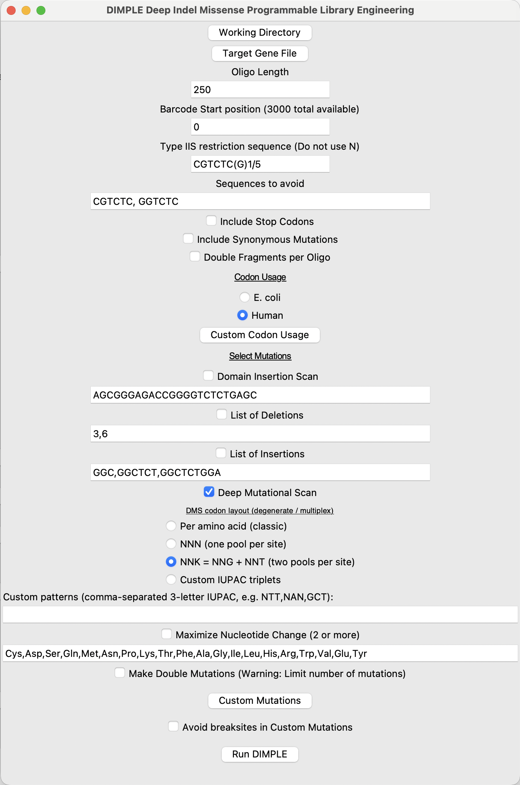

[](https://colab.research.google.com/github/coywil26/DIMPLE/blob/colab/DIMPLE.ipynb)

# DIMPLE: Deep Indel Missense Programmable Library Engineering

## Protein domain insertion via programmed oligo libraries

A Python script for generating oligo libraries and PCR primers for Deep Mutational Scanning library generation incorporating indel variation.

Take a look at the protocol on [protocols.io](https://www.protocols.io/view/dimple-library-generation-and-assembly-protocol-rm7vzy7k8lx1) for more information on generating and assembling libraries as well.

Note: This is the active repository for DIMPLE development. The archived repository containing the code used in the publication is [here](https://github.com/odcambc/DIMPLE), and is also archived at [Zenodo](https://zenodo.org/records/7574261).

# Installation

## Simple method

Run DIMPLE in a [Google Colab](https://colab.research.google.com/github/coywil26/DIMPLE/blob/colab/DIMPLE.ipynb) notebook (also linked above) without downloading or installing on your computer. Follow the prompts and generate a library.

## Local install

### Install requirements

#### Using Conda

Use the supplied Conda environment file to install and manage dependencies. This will create a new environment called `dimple_env`.

Use the following commands to install and load the environment:

```{bash}
conda env create -f dimple_env.yml
conda activate dimple_env
```

#### Manually install requirements

DIMPLE requires the following packages:

- python
- numpy
- biopython
- tkinter (only required for GUI version)

Install with your preferred package manager (e.g. pip).

Note: DIMPLE has been tested on Python version 3.12. Biopython is currently incompatible with Python 3.13 in some cases, and we recommend using Python 3.12 for now.

# Inputs

## Target gene file

Targeted genes should be supplied in [FASTA format](https://en.wikipedia.org/wiki/FASTA_format). To allow DIMPLE to check for nonspecific amplification, include the entire plasmid sequence of the library generation construct in the file.

The ORF can be specified in the fasta header for each target gene. If desired, the header should include the start and end positions of the gene in the plasmid, as follows:

```{text}
>gene1 start:10 end:100
ATGTT...
```

The start position should be the first base of the first codon, and the end position should be the last base of the last codon. Otherwise specify the ORF in the command line.

# Running DIMPLE

## Colab version

Using the [Google Colab](https://colab.research.google.com/github/coywil26/DIMPLE/blob/colab/DIMPLE.ipynb) notebook, follow the prompts and explanations. The mutation cell includes **DMS codon layout** options (`dms_codon_mode`, `dms_custom_codons`); see [DMS codon layout](#dms-codon-layout) below. Also check the options under [Command-line usage](#command-line-usage) for additional flags.

## Local version

We have supplied two methods to run DIMPLE: a command-line version, and a GUI.
Both offer the same functionality, but the GUI is more user-friendly.

### GUI usage

Start the GUI with the following command:

```{bash}
python run_dimple_gui.py
```



The following are required:

- Target gene file (see below for format requirements)
- One or more of the mutations to make to the target gene

Supply options, then generate the library by pressing **Run DIMPLE**. For Deep Mutational Scanning, choose a **DMS codon layout** under the DMS options (classic per–amino-acid sampling, `NNN`, `NNG`+`NNT` two pools, or custom IUPAC triplets); see [DMS codon layout](#dms-codon-layout) below.

### DMS codon layout

Substitution libraries: when **Deep Mutational Scan** is enabled, you can reduce the number of substitution oligos per site by using **degenerate / multiplex** codon patterns instead of drawing one codon per target amino acid.

| Mode | Behavior |
|------|----------|
| **Per amino acid (classic)** | Default: one designed variant per amino acid (and optional stop), with codons weighted by the selected usage table. |
| **NNN** | One pattern `NNN` per mutable codon (64 outcomes). Variant names use the pattern (e.g. `12_NNN`), not a single-letter change code. |
| **NNG + NNT** | Two patterns per site: `NNG` and `NNT` (same role as classic “NNK” split across G vs T at the third position). |
| **Custom** | Comma-separated 3-letter **IUPAC** DNA triplets (e.g. `NTT,NAN,GCT`). Supports `N`, `K` (G\|T), `S` (G\|C), etc., as defined in code. |

**Colab / notebook:** set `dms_codon_mode` and, for `custom`, `dms_custom_codons` in the mutation-settings cell.

**Command line:** `-dms_codon_mode {amino_acid,NNN,NNG_NNT,custom}` and, when using `custom`, `-dms_custom_codons "PAT1,PAT2,..."`.

**Python:** set `DIMPLE.dms_codon_mode` and `DIMPLE.dms_custom_codon_patterns` (a `list` of strings) before calling `generate_DMS_fragments`.

If you supply a **custom mutations** file (position-specific amino-acid lists), DIMPLE keeps the **classic per–amino-acid** path for those positions; multiplex modes apply only when that file is not used.

### Command-line usage

See a description of options for command-line version:

```{bash}
python run_dimple.py -h
```

Full list of options:

```{text}
options:
  -h, --help            show this help message and exit
  -wDir WDIR            Working directory for fasta files and output folder
  -geneFile GENEFILE    Input all gene sequences including backbone in a fasta format. Place all in one fasta file. Name description can include start and end points (>gene1 start:1
                        end:2)
  -handle HANDLE        Genetic handle for domain insertion. This is important for defining the linker. Currently uses BsaI (4 base overhang), but this can be swapped for SapI (3
                        base overhang).
  -dis DIS              use the handle to insert domains at every position in POI
  -matchSequences       Find similar sequences between genes to avoid printing the same oligos multiple times. Default: No matching
  -oligoLen OLIGOLEN    Synthesized oligo length
  -fragmentLen FRAGMENTLEN
                        Maximum length of gene fragment
  -overlap OVERLAP      Enter number of bases to extend each fragment for overlap. This will help with insertions close to fragment boundary
  -DMS                  Choose if you will run deep deep mutation scan
  -dms_codon_mode {amino_acid,NNN,NNG_NNT,custom}
                        DMS layout: classic per–amino-acid (default), NNN, NNG+NNT two pools, or custom IUPAC triplets
  -dms_custom_codons DMS_CUSTOM_CODONS
                        Comma-separated 3-letter IUPAC patterns when -dms_codon_mode is custom (e.g. NTT,NAN,GCT)
  -custom_mutations CUSTOM_MUTATIONS
                        Path to file that includes custom mutations with the format position:AA
  -usage USAGE          Default is "human". Or select "ecoli. Or change code"
  -insertions INSERTIONS [INSERTIONS ...]
                        Enter a list of insertions (nucleotides) to make at every position. Note, you should enter multiples of 3 nucleotides to maintain reading frame
  -deletions DELETIONS [DELETIONS ...]
                        Enter a list of deletions (number of nucleotides) to symmetrically delete (it will make deletions in multiples of 2x). Note you should enter multiples of 3 to
                        maintain reading frame
  -include_substitutions INCLUDE_SUBSTITUTIONS
                        If you are running DMS but only want to insert or delete AA
  -barcode_start BARCODE_START
                        To run DIMPLE multiple times, you will need to avoid using the same barcodes. This allows you to start at a different barcode.
  -restriction_sequence RESTRICTION_SEQUENCE
                        Recommended using BsmBI - CGTCTC(G)1/5 or BsaI - GGTCTC(G)1/5. Do not use N
  -avoid_sequence AVOID_SEQUENCE [AVOID_SEQUENCE ...]
                        Avoid these sequences in the backbone - BsaI and BsmBI. For multiple sequnces use a space between inputs. Example -avoid_sequence CGTCTC GGTCTC
  -include_stop_codons  Include stop codons in the list of scanning mutations.
  -include_synonymous   Include synonymous codons in the list of scanning mutations.
  -make_double          Make each combination of mutations within a fragment
  -maximize_nucleotide_change
                        Maximize the number of nucleotide changes in each codon for easier detection in NGS
```

# Example output

Example output files are located in the `examples` directory.

# Running test

To test DIMPLE, run the following command from the root directory:

  ```{bash}
python -m unittest discover
```

This should pass without any errors. If you encounter any issues, please open an issue on the GitHub repository.

# Citing DIMPLE

If you found DIMPLE useful, feel free to cite the publication describing it:

- Preprint: [Macdonald et al., 2022](https://doi.org/10.1101/2022.07.26.501589)
- Published: [Macdonald et al., 2023](https://doi.org/10.1186/s13059-023-02880-6)

# License

This code is licensed under the terms of the MIT license: [License](License.txt)

# Contributing

Contributions and feedback are welcome. Please submit an issue or pull request.

# Getting help

For any issues, please open an issue on the GitHub repository. For questions or feedback, email [Chris](https://www.wcoyotelab.com/members/).
